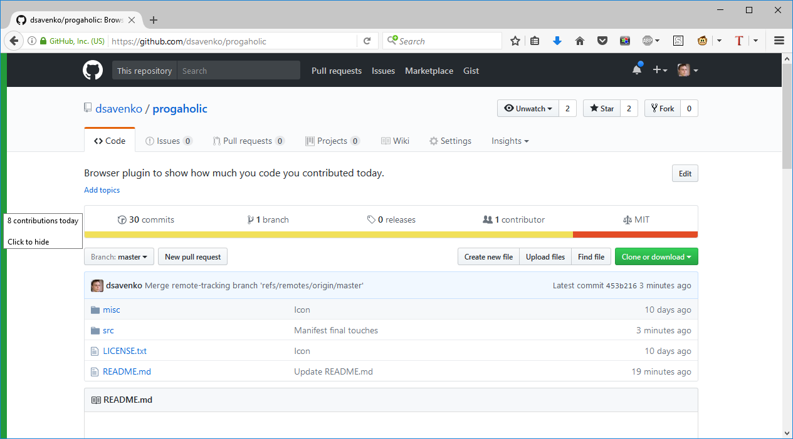
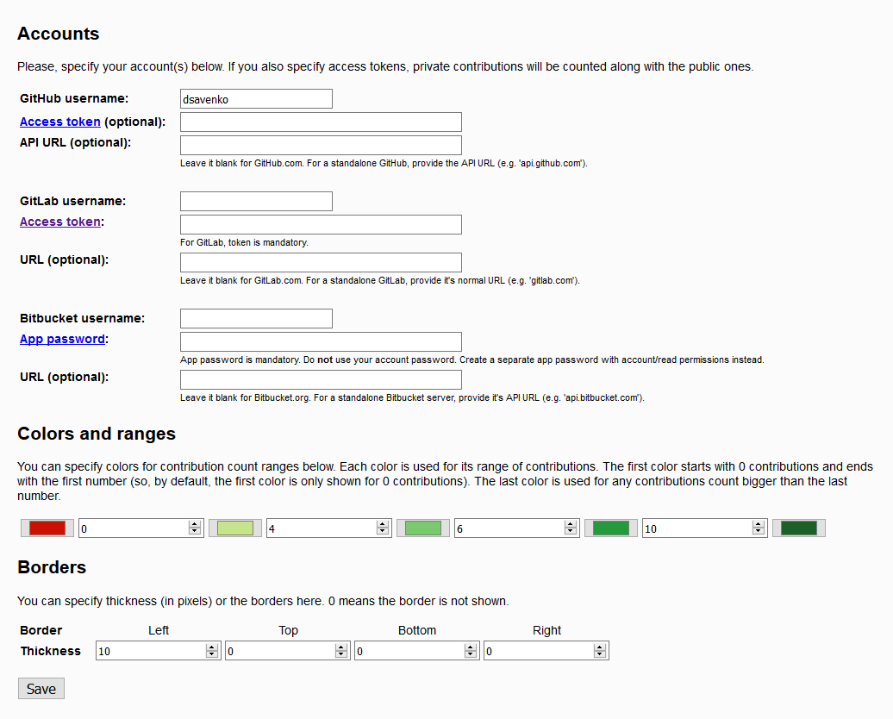

# Progaholic

Progaholic is a browser plugin to show how much you contributed today. The plugin counts your contributions (pushes, issues, etc) and shows how active you've been today on every web page you visit. The idea is to encourage you to do more instead of pointless web surfing.

Suitable for programmers, technical writers, QA engineers and anyone, who use GitHub, GitLab or BitBucket every day. 

> **Contribute more for the greater good! Be a progaholic!**

 

## Setup

When you install the plugin, its settings page opens. You need to specify at least on account there. Services currently supported are [GitHub](https://github.com), [GitLab](https://gitlab.com) and [BitBucket](https://bitbucket.org). For GitHub, you may not specify any access token, in which case only your public events will be counted. For the other two, you have to specify an access token.

You can point the plugin to the private (corporate) entries of the supported services. By default, the public ones are used.

Shortly after you give the plugin one or more accounts, it will show your contributions count on **any page of any website** you visit. Contributions are all events you do, including pushes, dealing with issues, managing repositories, etc. If you give multiple accounts to the plugin, their contributions will be summed. Only **today** contributions are taken into account. This means at 12:00 a.m. your contribution count is reset to 0.

The plugin can show your activity by displaying colored bars at the edges of web pages. You can configure:

* which edges to use (by default, it's only the left edge)

* thickness of the bars (by default, 10 pixels)

* colors and intervals. The plugin can use up to 5 different colors to display your contribution activity based on the number of contributions. By default, it's red for 0 contributions, and different greens the for `(0, 4]`, `(4, 6]`, `(6, 10]` and `(10, infinity)` intervals. You can change the colors and the intervals.

You can hover the bars to see the exact number of contributions. Clicking on the bars will hide them for the current page.

Don't forget to click `Save` at the end!

 

## Future plans

When Mozilla releases a [WebExtensions API for theming](https://blog.mozilla.org/addons/2017/02/24/improving-themes-in-firefox/), I will use it as an alternative method of displaying your activity. Actually, this was the original plan, but the API is not there yet.

## Feedback

Please, send me feedback, like bug reports, feature requests or pull requests! The best way would be by filing [issues here](https://github.com/dsavenko/progaholic/issues). You can also mail me at ds@dsavenko.com.

## Icon

The icon is produced from the overtime icon by Gan Khoon Lay from the Noun Project.
